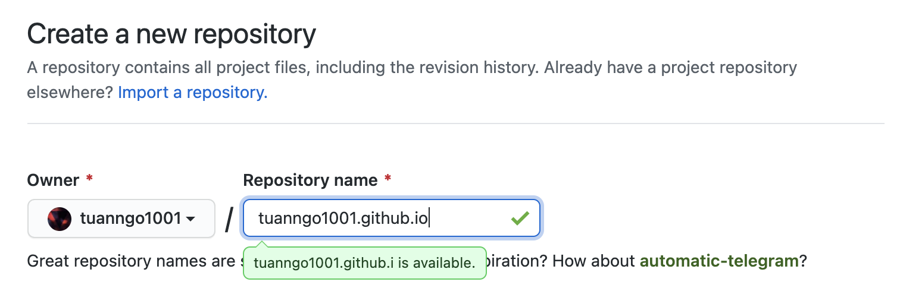
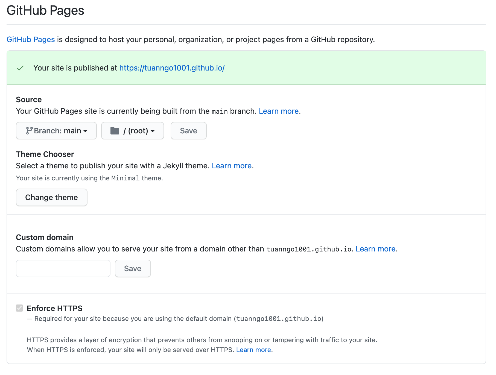
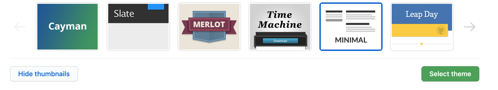

# How to Host a Resume on GitHub Pages

## Introduction
_This is how you create a Resume formatted in Markdown and host it on Github Pages using a Jekyll template._

### Audience Profile
>**Audience**: CS Students
>**Venue**: README in GitHub Pages
>**Purpose**: Explain how to host a resume on GitHub Pages.
>**Additional purpose**: Introduce and demo principles of Andrew Etter’s book Modern Technical Writing
>**Desired Reaction**: Being excited when following the steps and understanding Andrew Etter's general protocol
>**Vocabulary**: Technical, informal
>**Tone**: accurate, straightforward

## Contents

- [Getting Started](#getting-started)
- [How to create and host a resume](#how-to-create-and-host-a-resume)
- [Build Jekyll theme from scratch](#build-jekyll-theme-from-scratch)
- [More Resources](#more-resources)
- [Author and Acknowledgments](#author-and-acknowledgments)
- [FAQs](#faqs)

---

## Getting Started

#### Markdown:
- For technical writing, it is best to use a **_lightweight markup language_**. According to Andrew Etter's book _"Modern Technical Writing"_, he mentioned:
> "For documentation, lightweight markup is free and superior in every meaningful way."
- **Markdown** is a lightweight Markup Language that you can use to formatting components in your document. We use Markdown since it is the most popular Markup language for technical writing.
- Since Markdown has many flavours and we are creating a website using GitHub pages, we will choose GitHub Flavored Markdown.
- Start learning Markdown --> [here](https://www.markdowntutorial.com).

#### GitHub:
- For technical documents, to maintain and update it easily, a version control system is needed. I have chosen GitHub since we want to use GitHub Pages to create our Static Website.
- **GitHub** is a platform for version control, source code management, and collaborations for software developers using Git.
- For some of you do not know, **_Git_** is a distributed version control system for keeping track of any changes in the source code when developing software.
- Git and GitHub are powerful tools that you will need in the future career as programmers.

#### Jekyll:
- According to Andrew Etter, making use of a Static website for technical writing is fantastic because of its speed, simplicity, portability, and security. Instead of passing around your docx or pdf files, a simple URL for the static website the best.
- **Jekyll** is a simple static site generator that built-in with GitHub Pages, it will simplify the process of creating a website from scratch.
- Jekyll has the ability to transform a Markdown-formatted file into a working website in an instance.

## How to create and host a resume

1. Format your Resume using Markdown
    - For starters, you can use an online Markdown editors like [MarkdownLivePreview](https://markdownlivepreview.com).
    - However, Markdown has many specialized text editors exist for it. Since you are developers, you will have to programming and writing a Markdown technical document side by side. Therefore, using a code editors is better. Considering these code editors to work with:
        - Atom
        - Sublime Text
        - VSCode
        - Vim
    - I personally suggest Atom and VScode since they have extensions to review the Markdown format live side by side with your raw form. [Check this out!](https://marketplace.visualstudio.com/items?itemName=shd101wyy.markdown-preview-enhanced)
    - After formating your resume in Markdown, save it as an index.md file (.md is a file extension for Markdown documents).

    

2. Place your index.md file in Github's repository
    - First, sign in your GitHub account.
    _If you don't have a GitHub account, now is the best time to get one: go to **[Github account](https://github.com)**, using your student or organization emails to register a new account. Remember you will need to verify your email (Github will give you detail instructions on how to do it)._
    - Create a repository named _username_.github.io, where _username_ is your Github account's username.
    
    - You can use either **a terminal** or [Github Desktop application](https://desktop.github.com) to clone your _new repository_ in the folder you want to store your project on your PC. (check [this](https://docs.github.com/en/free-pro-team@latest/github/creating-cloning-and-archiving-repositories/cloning-a-repository) if you **don't know how to clone** a repository).
    - Put your Markdown-formatted Resume into the project folder, then push it to the Github repository. _There is also an option to commit using the web interface. However, it is better to use these below methods unless you only commit small changes._ 
    You can either use a terminal or the Github desktop app to commit your local changes to your GitHub repository:

    Terminal:

    ```bash
    git add --all
    git commit -m"Your commit message"
    git push -u origin main
    ```

    Github Desktop:
    

3. Next, you will want to choose a Jekyll template for your Github Page:
        - Go to **Settings** in your repository.
        - Inside the **Options** menu, scroll down until you see the **GitHub Pages** section.
        
        - Click the **Change theme** button and select your desire theme for your static page. 
            _Note_: These are the pre-built Jekyll theme that you can use. Go to the [Build Jekyll theme from scratch](#build-jekyll-theme-from-scratch) if you want to fully customize your theme.
        - Click the **Select theme** button to confirm your theme.
        
        - After committing your Jekyll theme, there will be a new file in your repository called **_config.yml**. You can customize the chosen theme by modifying this file. Click [here](https://github.com/pages-themes/minimal/blob/master/README.md) on how to customize the **_config.yml** file of your theme.

4. Finally, go to **_username.github.io_** to view your Resume.
    - This is how your Markdown-formatted resume will turn into a static website using Jekyll template:
    

## Build Jekyll theme from scratch

For this project, I used a pre-build Jekyll theme called **[Minimal](https://github.com/pages-themes/minimal)**. If you want to fully create your Jekyll theme, go to [Jekyll Docs](https://jekyllrb.com/docs/).

## More Resources
- [Markdown tutorial](https://www.markdowntutorial.com)
- Andrew Etter's ebook on [Modern Technical Writting](https://www.amazon.ca/Modern-Technical-Writing-Introduction-Documentation-ebook/dp/B01A2QL9SS)
- [Jekyll](https://jekyllrb.com)

## Author and Acknowledgments
- **Author**: Tuan Ngo
- **Group members**: Renan, Adam, Jaspreet
- **Reference**: All the process is followed Andrew Etter's protocol from his book.
- **Jekyll Template:** The Contributors of [Minimal theme](https://github.com/pages-themes/minimal).

## FAQs
##### Why using Markdown for technical writings other than MS Word?
- We could have used MS Word to format a document like a Resume, although it is wonderful to have a good looking format using Word. However, the purpose of the whole project is hosted your Resume online and Word file format .docx is not a good choice for creating a website.

##### How to change the title on my static page?
- To change your title on your static page using Jekyll, in your _config.yml_ file, add
```yml
 title: [your title]
 ```

 ##### Why is my resume not showing up?
 - GitHub Pages and Jekyll need a little time to generate your static page when created and updated. Wait for a few minutes and then refresh it. Please double-check if you got the correct repository's name _[username].github.io_
 - If it is showing a 404 error, check if you have your index.md place in your root folder. Go to this link ```https://github.com/<username>/<username>.github.io/settings``` to check if you have enabled the GitHub pages setting.
